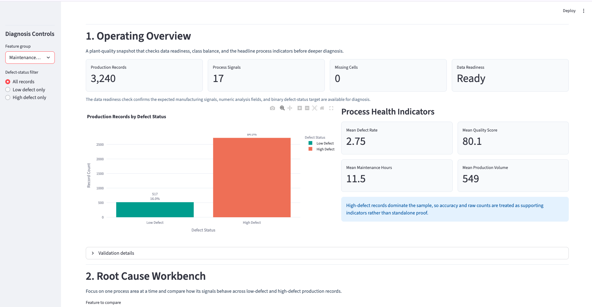
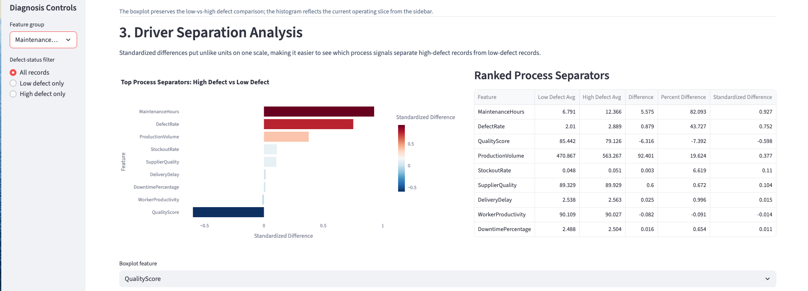
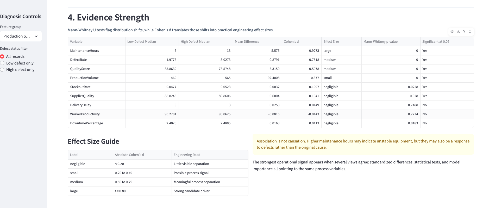
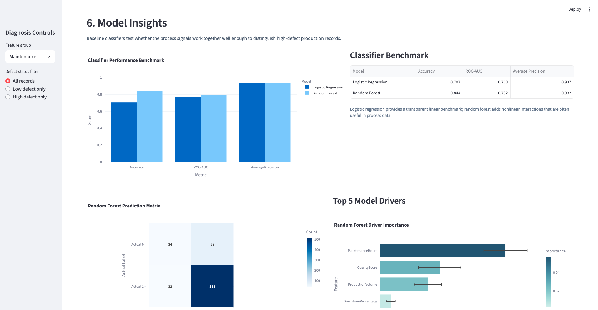

# Manufacturing Defect Root Cause Explorer

An interactive Streamlit dashboard for exploring process signals associated with high-defect manufacturing records.

## Dashboard Preview

### Operating Overview



### Driver Separation Analysis



### Evidence Strength



### Model Insights



## Portfolio Summary

As a first-year mechanical engineering student, I built this project to explore how Python, statistics, machine learning, and interactive dashboards can support manufacturing quality analysis.

## Project Objective

The goal of this project is to identify process signals associated with high-defect production records and present those patterns in an interactive dashboard. The dashboard is designed to help a manufacturing engineer move from raw production data toward a focused investigation of maintenance activity, process stability, production load, and quality performance.

## Dataset

The dataset is synthetic and contains 3,240 production records with 17 process and quality columns. It includes production volume, production cost, supplier quality, delivery delay, defect rate, quality score, maintenance hours, downtime percentage, inventory turnover, stockout rate, worker productivity, safety incidents, energy consumption, energy efficiency, additive process time, additive material cost, and defect status.

Because the data is synthetic, the findings show analytical associations inside this dataset. They should not be interpreted as real plant-floor causal proof.

## Dashboard Features

- **Operating Overview**: Validates the dataset and summarizes production records, process signals, missing values, class balance, and key manufacturing KPIs.
- **Root Cause Workbench**: Lets users inspect feature groups and compare process behavior across low-defect and high-defect records.
- **Driver Separation Analysis**: Ranks variables by standardized differences between defect-status groups.
- **Evidence Strength**: Presents Mann-Whitney U test results, Cohen's d effect sizes, and practical effect-size labels.
- **Correlation Explorer**: Shows relationships between process variables, `DefectRate`, and `DefectStatus`.
- **Model Insights**: Compares logistic regression and random forest models, including confusion matrix and feature importance.
- **Data Explorer**: Provides a filterable production-record table and CSV export.

## Methods

This project uses a mix of exploratory analysis, statistical testing, and baseline machine learning:

- Data validation for expected columns, numeric analysis fields, missing values, and binary `DefectStatus`
- Defect-status comparison between low-defect and high-defect records
- Standardized differences to compare variables measured in different units
- Mann-Whitney U tests to check distribution differences between defect-status groups
- Cohen's d effect sizes to estimate practical separation between groups
- Correlation analysis with `DefectRate` and `DefectStatus`
- Logistic regression as an interpretable baseline classifier
- Random forest as a nonlinear baseline classifier
- Feature importance analysis to identify influential process signals in the random forest model

## Key Findings

The strongest observed associations in this synthetic dataset were:

- `MaintenanceHours`: higher values were associated with high-defect records
- `DefectRate`: higher values were associated with high-defect records, as expected from the defect-status definition
- `QualityScore`: lower values were associated with high-defect records
- `ProductionVolume`: higher values were associated with high-defect records

These findings should be interpreted as associations, not causal claims. For example, higher maintenance hours may indicate unstable equipment, but they may also reflect maintenance activity after defects have already occurred.

## Engineering Interpretation

A dashboard like this could help a manufacturing engineer prioritize where to investigate first. Instead of scanning many process columns manually, the app highlights maintenance, quality, and production-load signals that appear most different between low-defect and high-defect records.

In a real manufacturing setting, these results could guide follow-up questions such as:

- Are high-maintenance machines also producing more defects?
- Do defect patterns vary by production line, shift, batch, or product family?
- Does increased production volume coincide with lower process stability?
- Are quality-score drops visible before defect rates increase?

The dashboard is best viewed as an engineering triage tool: it narrows the investigation, but real root-cause confirmation would require plant-floor context and operational validation.

## Project Structure

```text
.
├── app.py
├── data/
│   └── manufacturing_defect_dataset.csv
├── notebooks/
│   └── manufacturing_defect_analysis_enhanced.ipynb
├── src/
│   ├── analysis.py
│   ├── data_loader.py
│   ├── feature_groups.py
│   ├── modeling.py
│   └── visualizations.py
└── requirements.txt
```

## How to Run Locally

```bash
python3 -m pip install -r requirements.txt
streamlit run app.py
```

## Limitations

- The dataset is synthetic and does not represent a verified real production system.
- The target classes are imbalanced, with high-defect records making up most of the dataset.
- The data does not include real machine, shift, batch, operator, product-family, or maintenance-history context.
- Model results should be treated as demonstration-level analytics, not as a production-ready prediction system.
- The dashboard identifies associations and investigation priorities, not causal proof.

## Future Improvements

- Replace the synthetic dataset with real production data.
- Add machine-level or shift-level filters.
- Add batch tracking and product-family segmentation.
- Include predictive maintenance data such as sensor readings, failure history, and maintenance type.
- Deploy the dashboard online for interactive portfolio viewing.
